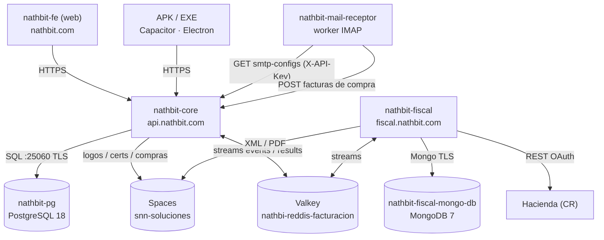

# 🏗️ Infraestructura — NathBit en DigitalOcean

> **Documento harmonizado.** La sección **“Panorama general”** es idéntica en los 4 repos
> (`Back-NathBit-POS`, `nathbit-fiscal`, `Nathbit-POS-FE-Angular`, `MailReceptor`).
> La sección **“Este repositorio”** detalla el componente que vive acá.
>
> Contexto: julio 2026 se migró de droplets con `docker-compose` artesanal → **DO App Platform**
> (cómputo) + **bases gestionadas** (datos) + **Spaces** (archivos), todo dentro de una **VPC**.

## Panorama general

Todo NathBit corre en **DigitalOcean**. Ya no hay droplets ni `docker-compose` a mano.

### Componentes (App Platform, región NYC)

| App | Tipo | Dominio | Repo |
|---|---|---|---|
| `nathbit-core` | Web Service | `api.nathbit.com` | Back-NathBit-POS |
| `nathbit-fiscal` | Web Service | `fiscal.nathbit.com` | nathbit-fiscal |
| `nathbit-mail-receptor` | Worker | (sin URL pública) | MailReceptor |
| `nathbit-fe` | Static Site | `nathbit.com` · `www.nathbit.com` | Nathbit-POS-FE-Angular |

Todos con **autodeploy** desde su rama (App Platform buildea desde el `Dockerfile` / build command;
**no** hay GitHub Actions de deploy). Ramas: core `master`, fe `master`, fiscal `main`,
mail-receptor `main` *(confirmar en consola)*.

### Bases de datos gestionadas (NYC1, dentro de `nathbit-vpc`)

| Cluster | Motor | Specs | Lo usa |
|---|---|---|---|
| `nathbit-pg` | PostgreSQL 18 | 1 GB / 10 GiB | core |
| `nathbi-reddis-facturacion` | Valkey 8 | 1 GB | core + fiscal (stream de facturación) |
| `nathbit-fiscal-mongo-db` | MongoDB 7 | 1 GB / 15 GiB | fiscal (base `nathbit_fiscal`) |

- **Postgres** — puerto directo `25060` (no el pooler `25061`), `sslmode=require`.
- **Valkey** — puerto `25061`, TLS. Timeout de comando alto (≥60 s) por los reads bloqueantes del stream.
- **Mongo** — `mongodb+srv`, TLS, `authSource=admin`, base `nathbit_fiscal`.

### Almacenamiento

- **Spaces `snn-soluciones`** (NYC3) — `https://snn-soluciones.nyc3.digitaloceanspaces.com`.
  Guarda logos y certificados (core), XML/PDF de facturas (fiscal) y documentos de compras (core),
  bajo la estructura estándar `Nathbit-POS/{PAIS}/{cedula}_{razon}/...`.

### Red (VPC)

- **`nathbit-vpc`** (NYC1, `10.116.0.0/24`, DEFAULT): corren aquí las **3 BD gestionadas** + los
  **2 Web Services** (`nathbit-core`, `nathbit-fiscal`). App ↔ BD va por red privada.
- El **worker** (mail-receptor) y el **static site** (fe) no necesitan la VPC (solo HTTP público).

### Flujo de datos

### Modelo de despliegue

- **Deploy:** push a la rama default → App Platform rebuildea y redespliega solo (zero-downtime,
  health checks nativos, **rollback de 1 clic** desde la consola).
- **CI:** GitHub Actions corre tests/builds (no deploy). El FE además buildea **APK** (Capacitor)
  y **EXE** (Electron).
- **Secretos:** en variables de entorno **encriptadas** por app en App Platform (nunca en el repo).

---

## Este repositorio: `nathbit-mail-receptor` (worker de correo)

Worker que revisa buzones **IMAP** y reenvía las facturas de compra recibidas al core.

- **App Platform:** **Worker** `nathbit-mail-receptor` (sin URL pública),
  `instance_size_slug: basic-xxs`. Ver [`.do/app.yaml`](.do/app.yaml).
- **Build:** `Dockerfile`, autodeploy.
- **Desacoplado de Postgres:** lee la configuración de buzones del core por HTTP
  (`GET https://api.nathbit.com/api/facturas-recepcion/smtp-configs`, con `X-API-Key`) y postea las
  facturas de compra al core. **No accede a ninguna BD** → no necesita la VPC.

### Variables de entorno (App Platform)
- `SPRING_PROFILES_ACTIVE=prod`
- `NATHBIT_API_KEY` — **debe coincidir** con `APP_MAILRECEPTOR_API_KEY` del core.

Encriptadas en la consola.

### ⚠️ Regla operativa
**Un solo MailReceptor activo a la vez.** Si corren dos (p. ej. el viejo del droplet + este worker),
marcan los mismos correos como leídos y se pisan → facturas duplicadas o perdidas.

### Despliegue
Push a su rama default → App Platform rebuildea y redespliega. El antiguo workflow de deploy por SSH
al droplet fue eliminado en la migración.
